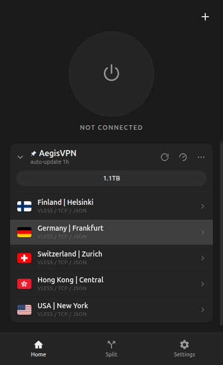
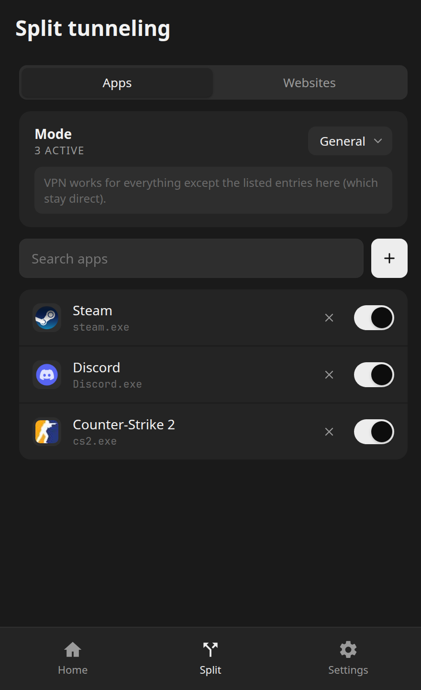
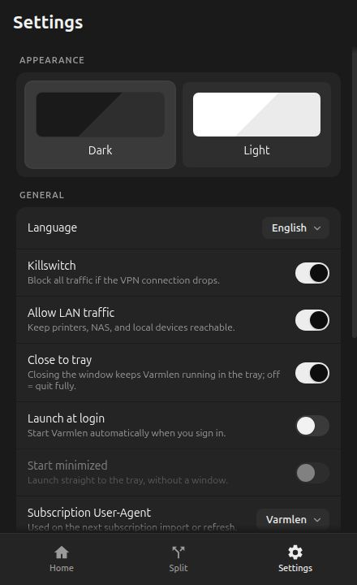

# Varmlen Client Windows

Open-source xray-core VPN client for Windows, with per-app and per-domain split
tunneling. Built on Tauri 2 and SvelteKit.

> Status: pre-release. The x64 and ARM64 installers are complete and pass
> automated build/package checks; final VPN acceptance still requires a real
> Windows machine.

## Screenshots

<table>
  <tr>
    <th width="33.333%">Home</th>
    <th width="33.333%">Split tunneling</th>
    <th width="33.333%">Settings</th>
  </tr>
  <tr>
    <td></td>
    <td></td>
    <td></td>
  </tr>
</table>

## Features

- Xray's native TUN inbound over Wintun; there is no tun2socks or proxy mode.
- VLESS, VMess, Trojan, Shadowsocks, Hysteria2, WireGuard, HTTP and SOCKS5
  outbounds, including share-link lists, standard WireGuard configurations and
  provider-supplied multi-outbound JSON profiles.
- Per-app and per-domain split tunneling in independent general/selective modes.
- Transactional reconnect: the candidate is validated before the active tunnel
  is stopped, and the previous connection is restored if the candidate fails.
- DNS is intercepted by the native TUN and resolved through Xray's proxied DoH
  path instead of the physical adapter resolver.
- A `LocalSystem` service owns Xray, Wintun and encrypted desired state, so the
  tunnel survives closing the GUI.
- Xray configuration syntax and actual SOCKS5 reachability are checked before
  the native TUN is changed.
- Application discovery covers 32/64-bit registry views, Steam install folders
  and `XboxGames` libraries. Every suggested or manually selected entry is one
  exact `.exe`; additional campaign/multiplayer binaries can be added with the
  file picker.
- The kill switch is deliberately disabled in this preview while the previous
  user-mode WFP enforcement is replaced.

## Security model

The unprivileged UI communicates with `VarmlenService` through a versioned,
size-limited named-pipe protocol. The pipe ACL and client-token check restrict
commands to `LocalSystem` and the interactive user recorded by the installer.
Runtime binaries live under the machine installation directory; mutable state
is protected under `%ProgramData%\Varmlen`.

The connection path does not install WFP filters. The service and uninstaller
retain bounded best-effort cleanup for policy left by earlier preview builds;
a cleanup warning never prevents the user from uninstalling Varmlen.

See [the architecture](docs/design/2026-07-29-windows-client.md) and the
[Windows security/reliability audit](docs/security-audit-2026-08-08.md).

## Local build

The build scripts download pinned Xray 26.3.27 and Wintun 0.14.1 archives,
verify their SHA-256 hashes, cross-compile the service and GUI, and create a
per-machine NSIS installer:

```text
./scripts/build-windows.sh x64
./scripts/build-windows.sh arm64
```

Requirements: Node.js 22, Rust, `cargo-xwin`, LLVM/Clang, `unzip`, `curl` and
NSIS.

## Verification

```text
npm test
npm run check
npm run build
cargo test --workspace
cargo clippy --workspace --all-targets -- -D warnings
cargo xwin check --workspace --target x86_64-pc-windows-msvc
cargo xwin check --workspace --target aarch64-pc-windows-msvc
```

The release artifacts are:

```text
target/x86_64-pc-windows-msvc/release/bundle/nsis/Varmlen_0.3.0_x64-setup.exe
target/aarch64-pc-windows-msvc/release/bundle/nsis/Varmlen_0.3.0_arm64-setup.exe
```

## License

[GNU General Public License v3.0 only](LICENSE).
